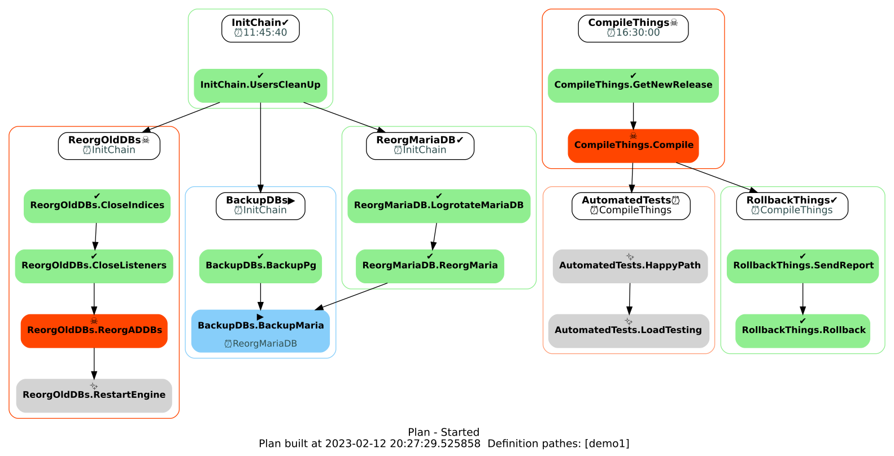
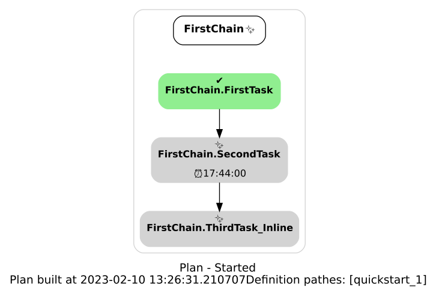
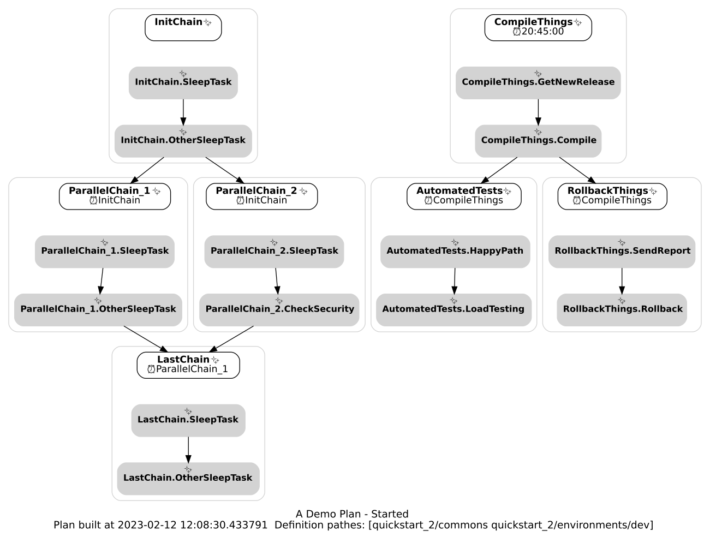
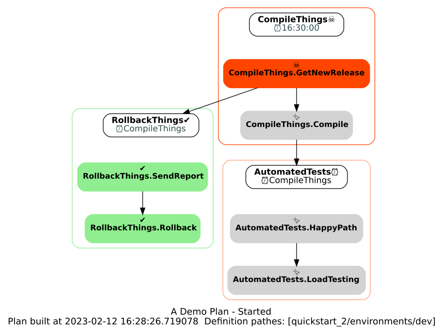

=============
OpenScheduler
=============

Introduction
************

Qu'est-ce que OpenScheduler ?
""""""""""""""""""""""""""""""

Réponse courte : un ordonnanceur de tâches Open Source.

Un peu plus en détail :

- Il permet de lancer des tâches à des instants définis selon certaines conditions.
- Il se veut simple d'utilisation, léger et modulaire, capable de gérer des dépendances complexes.
- Basé sur Python/FastAPI et asyncio/uvloop, il se pilote par API et est facilement dockérisable. 

Avantages par rapport aux outils du marché : Libre, ouvert via API, léger, facile à déployer (y compris dans une AlpineLinux Dockerisée), conçu pour tourner en standalone ou en interconnexion décentralisée. Ne nécessite pas de base de donnée ni autre outil externe.

Tout comme les bons schedulers du marché, propose une excellente traçabilité via les logs, peut gérer des dépendances complexes.

Inconvéniants : en cours de développement, actuellement pas de front-end, actuellement pas de gestion de droits. 

Scheduling as code!
"""""""""""""""""""
Les définitions sont décrites en YAML et l'architecture des définitions permet une grande souplesse. Il est prévu pour être maintenu via un repo Git.

Fonctionnement général
======================

- Un ``Builder`` produit des plans à la demande et sur mesure.
- Un ``Plan`` contient les actions à exécuter, les conditions et autres paramètres.
- Un ``Runner`` est un agent qui fait construire un ``Plan`` au ``Builder`` et l'exécute selon les contraintes données (ex.: contraintes horaires).
- Les définitions des objets sont décrits en yaml et organisés de façon à ce que le ``Builder`` y puise les éléments pour composer le ``Plan`` d'après les paramètres reçus.

Exemple d'un plan :

Tutoriel
========

Après installation du builder et du runner, suivre les étapes suivantes.

Lancer le builder
-----------------

::

  uvicorn builder_server:app
  
En production une configurations plus avancée pourra être requise.

- Le status peut être obtenu avec ``curl`` http://localhost:8000/status ou avec un navigateur.
    - Exemple de status: ``status`` : ``{"status":"Up and Running","objects":{"categories":11,"objects":{"chains":30,"tasks":50,"variables":13}}}``
- Les API documentées sont accessibles et directement utilisables depuis un navigateur http://localhost:8000/docs
- Les logs (par défaut sur stdout) indiquent les objets chargés.

Lancer le runner
----------------
  
Lancer le runner sur un port différent.

::

  uvicorn runner:app --port 8888

- Le status http://localhost:8888/status renvoie ``404`` à ce stade ``{"status":"Up","detail":"No plan loaded"}``

Charger un plan simple
^^^^^^^^^^^^^^^^^^^^^^
  
Il existe deux manières de construire et charger un plan. La première avec un GET pour obtenir les définitions d'un répertoire et ses sous-répertoires. Une autre possibilité plus élaborée (POST) que nous détaillerons plus bas.

Par défaut, le builder charge les définitions depuis le répertoire examples/ (qui constituera le chemin racine '/'), et tous ses sous-répertoires. Nous allons charger un plan simple à partir de examples/quickstart_1.

``curl`` http://localhost:8888/plan/build/quickstart_1

Lorsque le ``Runner`` reçoit cette requête, il va :

- Demander au builder d'initialiser un plan avec toutes les définitions sous `quickstart_1`
- Charger ce plan
- L'exécuter.

Un GET /status renvoie alors 

::

  {"status":"Up","plan":{"name":"Plan","status":"Started"},"detail":"get /plan/status for more details"}

La console sur laquelle a été lancée le ``runner`` affiche les logs du déroulement du plan.
Nous explorerons plus tard les API pour obtenir plus d'informations sur les objets.

Analyse de examples/quickstart_1/easy_plan.yaml
^^^^^^^^^^^^^^^^^^^^^^^^^^^^^^^^^^^^^^^^^^^^^^^

Dans cet example nous avons chargé un plan à partir des définitions du ``builder``. Le répertoire de définitions se trouve dans src/examples. Regardons en détail ``examples/quickstart_1`` qui ne contient que le fichier ``easy_plan.yaml``.

::

  ---
  # Easy Plan is a simple independant plan showing basic concepts

  # Chains definitions
  # A Chain must declare a name,and at least one task.
  chains:
  - name: FirstChain
    tasks:
    - FirstTask              # This task references a task definition by its name
    - SecondTask             # Another one
    - name: ThirdTask_Inline # This task is defined inline, just for this chain.
      kind: CMD
      command: sleep 5
  
  # Tasks definitions 
  # A task definition must have at least a name, a kind,
  # and the specific attibutes for this kind
  tasks: 
  - name: FirstTask 
    kind: CMD        # CMD is a kind of task which will execute a command:
    command: sleep 2 # The first term is the executable command, optionnaly followed by some arguments
  - name: SecondTask
    kind: CMD
    command: uptime
    deps:         # A dep defines a dependecy. The object (chain or task) will start after the deps are resolved. 
    - kind: time  # A time dep is resolved after the defined time
      time: 17:44 # In this case, the object will start today at 17:44

Si ce fichier est modifié, pour qu'il soit pris en compte il faut :

- faire relire les définitions au ``Builder`` : http://localhost:8000/admin/defs/reload
- pour le tester sur un ``Runner`` : http://localhost:8888/plan/build/quickstart_1 , mais qui renverra une erreur si un plan est déjà chargé. Dans ce cas il faut passer l'option ``force`` http://localhost:8888/plan/build/quickstart_1?force=true

Utilisation avancée
===================

Considérons le contenu de ``quickstart_2`` ::

  .
  ├── commons
  │   ├── chains.yaml
  │   └── tasks.yaml
  └── environments
      ├── dev
      │   ├── compilation
      │   │   └── main.yaml
      │   └── variables.yaml
      └── prod
          ├── backups.yaml
          ├── batches.yaml
          └── variables.yaml
  
Le répertoire ``commons`` contient des objets de base que nous voulons toujours charger, et ``dev`` contient des schedulables spécifiques, ainsi que les variables de configuration pour les commons. Pour charger ces éléments nous allons passer une requête ``POST /plan/build`` accessible dans l'interface *swagger* http://127.0.0.1:8888/docs#/default/build_plan_plan_build__post .

Les paramètres du body seront les suivants (nous allons également jouer avec les variables) : ::

  {
    "name": "A Demo Plan",
    "def_pathes": [
      "quickstart_2/commons",
      "quickstart_2/environments/dev"
    ],
    "variables": {"sleep_time": 3}
  }
  
Renvoie ``201`` ::

  {
    "plan": "A Demo Plan",
    "message": "created"
  }

Nous avons chargé le plan :

Les chaînes de compilation, à droite, déclarent une chaîne pour le cas où ``CompileThings`` sort en ``Success`` et une chaîne en cas d'erreur.

Extrait, chaîne de rollback::

  - name: RollbackThings
    desc: If something goes wrong rollback to previous version
    deps:
    - kind: chain
      depends_on: CompileThings
      status: Failed # in this case the chain will start when the CompileThings status is Failed. If not specified, activates when status is Success.
    tasks:
    - name: SendReport
    - name: Rollback

Note : les conditions de succès peuvent être spécifiées dans une tâche::

  - name: CheckSecurity
    kind: SHELL
    command: ls -lR /root
    rc_ok: 2 # Specify which return code means Success, by default 0

Voyons en détail la tâche en erreur, soit via un navigateur vers http://127.0.0.1:8888/docs#/default/chain_task_list_chains__cname___tnum__get soit par exemple avec ``curl``::

  curl -X 'GET' \
    'http://127.0.0.1:8888/chains/CompileThings/0' \
    -H 'accept: application/json'

Résultat d'exécution, extraits commentés ::

  {
    "name": "CompileThings.GetNewRelease",
    "variables": {
      "sleep_time": 3,
      "other_sleep_time": "21",
      "project_dir": "/tmp/toto"  <----- variable defined in environments/dev/variables.yaml
    },
    "def_org": "quickstart_2/environments/dev/compilation/main.yaml",
    "kind": "CMD",
    "command": "git pull",        <----- command defined in the task (could contain variables)
    "rc_ok": 0,                   <----- return code for success
    "cwd": "$project_dir",        <----- working directory defined in the task, using a variable
    "status": "Failed",
    "perf_timer": {
      "run_time": 0.008,
      "wait_time_start": 0,
      "wait_time": 0,
      "started_at": "2023-02-12T18:07:31",
      "ended_at": "2023-02-12T18:07:31"
    },
    "rc": 128,                    <----- real return code
    "pid": 50628,
    "stdout": "",                 <v----- stdin/stderr after the execution
    "stderr": "fatal: not a git repository (or any of the parent directories): .git\n",
    "formatted_cmd": [            <----- real command executed
      "git",
      "pull"
    ],
    "formatted_cwd": "/tmp/toto"  <----- real working dir
  }

Les variables
-------------

Les variables peuvent être déclarées dans les définitions de *schedulables* (chaînes et tâches), dans une section ``variables`` d'un docuent YAML et au niveau du plan, lors de sa demande de construction. Bientôt lors du runtime et résultat d'exécution d'une tâche.

Elles peuvent être utilisées dans les ``command`` de tâches de type CMD et SHELL, ``cwd``, à terme sur les différents paramètres des *schedulables*.

L'ordre de priorité du moins important au plus important ::

  Def. Tâche << Def Chaîne << Def Variable << Build Plan.

La définition dans un *schedulable* est donc un fallback, nous pouvons donc en affiner son fonctionnemenrt en chargeant des fichiers de variables dans des répertoires de définitions particuliers, ou à la demande lors de lacréation d'un plan.

API
===

Builder
-------

GET methods

+------------------------+--------------------------------------------------+
| Endpoint               | Decription                                       |
+========================+==================================================+
| /status                | Server status                                    |
+------------------------+--------------------------------------------------+
| /admin/defs/reload     | Rebuilds defs by reading all YAML files          |
+------------------------+--------------------------------------------------+
| /plan/build/{def_path} | Builds a simple plan                             |
+------------------------+--------------------------------------------------+

POST method

+------------------------+-------------------------------+
| Endpoint               | Decription                    |
+========================+===============================+
| /plan/build            | Builds a plan with parameters |
+------------------------+-------------------------------+

Détail du payload :

::

  {
    "start_day": 0,
    "name": "Plan",
    "def_pathes": [
      "path1",
      "path2"
    ],
    "variables": {}
  }

Note :
Les définitions ne devraient pas être modifiables par API, il est prévu qu'elles soient uniquement mises à jour par des ``git pull`` sur un repository soigneusement géré.

Runner
------

GET methods

+-----------------------------------+---------------+------------------------------------+--------------------+
| Endpoint                          | ? Params      | Decription                         | Default            |
+===================================+===============+====================================+====================+
| /chain/{cname}/deps               | ?subs         | Get chain deps and tasks if subs   |                    |
+-----------------------------------+---------------+------------------------------------+--------------------+
| /chain/{cname}/status             | f=a,b,c       | Returns fields a,b,c               | all                |
+-----------------------------------+---------------+------------------------------------+--------------------+
| /chain/{cname}                    | f,=a,b,c      | Returns a list ok tasks            | name, tnum, status |
+-----------------------------------+---------------+------------------------------------+--------------------+
| /chain/{cname}/task/{tnum}/dep    |               | Get this task deps                 |                    |
+-----------------------------------+---------------+------------------------------------+--------------------+
| /chain/{cname}/task/{tnum}        | f=a,b,c       | Returns fields a,b,c               | all                |
+-----------------------------------+---------------+------------------------------------+--------------------+
| /plan/build/{path}                |               | Builds a simple plan               |                    |
+-----------------------------------+---------------+------------------------------------+--------------------+
| /plan/status                      | f=a,b,c       | Returns fields a,b,c               | all                |
+-----------------------------------+---------------+------------------------------------+--------------------+
| /snapshots/                       |               | List the available snapshots       |                    |
+-----------------------------------+---------------+------------------------------------+--------------------+
| /status                           |               | Returns fields a,b,c               | all                |
+-----------------------------------+---------------+------------------------------------+--------------------+

POST method

+---------------------------------------------+-----------------------------------------------+
| Endpoint                                    | Decription                                    |
+=============================================+===============================================+
| /chain/{cname}/cancel                       | Cancels the current task and this chain       |
+---------------------------------------------+-----------------------------------------------+
| /chain/{cname}/dep/{num}/cancel             | Solves this dep (set field active=False)      |
+---------------------------------------------+-----------------------------------------------+
| /chain/{cname}/force_status                 | Changes the chain's status, continue the plan |
+---------------------------------------------+-----------------------------------------------+
| /chain/{cname}/rerun                        | Reruns this chain                             |
+---------------------------------------------+-----------------------------------------------+
| /chain/{cname}/resume                       | Resumes this chain to next task               |
+---------------------------------------------+-----------------------------------------------+
| /chain/{cname}/start                        | Runs this chain                               |
+---------------------------------------------+-----------------------------------------------+
| /chain/{cname}/task/{tnum}/cancel           |                                               |
+---------------------------------------------+-----------------------------------------------+
| /chain/{cname}/task/{tnum}/dep/{num}/cancel | Solves this dep                               |
+---------------------------------------------+-----------------------------------------------+
| /chain/{cname}/task/{tnum}/kill             | Sends SIGTERM or SIGKILL to this task         |
+---------------------------------------------+-----------------------------------------------+
| /chain/{cname}/task/{tnum}/rerun            | Reruns this task                              |
+---------------------------------------------+-----------------------------------------------+
| /chain/{cname}/task/{tnum}/resume           |                                               |
+---------------------------------------------+-----------------------------------------------+
| /chain/{cname}/task/{tnum}/start            |                                               |
+---------------------------------------------+-----------------------------------------------+
| /plan/cancel                                | Cancels all the running objects               |
+---------------------------------------------+-----------------------------------------------+
| /plan/kill                                  | Interrupts all the running objects            |
+---------------------------------------------+-----------------------------------------------+
| /plan/rerun                                 |                                               |
+---------------------------------------------+-----------------------------------------------+
| /plan/resume                                |                                               |
+---------------------------------------------+-----------------------------------------------+
| /plan/start                                 |                                               |
+---------------------------------------------+-----------------------------------------------+
| /snaphot/restore/{snapshot_id}              | Restore a snapshot                            |
+---------------------------------------------+-----------------------------------------------+
 
Third party
-----------

Comme tous les éléments sont accessibles par API, il est aisé de développer des interfaces front de type node.js. Les images dans ce document ont été réalisées avec un script python qui génère un graph avec pydot/graphviz d'après un GET http://localhost:8888/plan/status?detail=full .

Objets
======

Les objets *Schedulables*
-------------------------

Les ``Task``, ``Chain`` et ``Plan`` sont des *schedulables*. Ils ont en commun les attributs suivants :

Dépendances
=> écrire rapidement dep. condition de sortie d'un schedulable

Tâches
------

- CMD et SHELL sont quasiment identiques. Execute une commande pour le premier, le second est capable de redirections et autres astuces. Ces éléments peuvent être définis comme des templates, dont les variables sont injectées juste avant l'exécution.
- API : *Roadmap* Permettront des requêtes vers d'autres services et de réagir en fonction des résultats.
- Commandes internes : permettant d'activer des fonctionnalités du runner. Actuellement accessible avec un CMD ou SHELL via ``curl``

Chaînes
-------

Une chaîne contient une liste ordonnée de tâches, en garanti la bonne exécution et l'intégrité.

Plan
----

Un plan contient un ensemble de chaînes, en garanti la bonne exécution et l'intégrité. Il gère également les variables et à terme les calendriers et autres aspects temporels de l'ordonnancement. C'est un *schedulable*, mais aucune gestion de dépendances n'est implémentée actuellement.

Dépendances
-----------

Ls dépendances s'appliquent aux objets *schedulables* , c'est-à-dire ``chain`` et ``task``

- chain : une dépendance de chaîne attend l'état (Success par défaut) d'une ou plusieurs chaînes pour être résolue.
- time : une dépendance de type time attend un moment. Actuellement une heure de ce jour. *Roadmap*: jour de la semaine, jour du mois, jour ouvré ou week-end et objets issus de calendriers custom.
- fichier : *Roadmap* Attend la présence d'un fichier (comprenant des options telles que 'fichier accessible en lecture', 'dont la taille n'évolue plus')

Variables
---------

Les variables sont actuellement utilisées pour l'interpolation des commandes et working directories pour les tâches CMD et SHELL, leurs possibilités seront étendue par la suite. 

L'ordre de priorité du moins important au plus important ::

  Def. Tâche << Def Chaîne << Def Variable << Build Plan.

Ressources
----------

Voir *Roadmap*.

Status
------

:: 

    Ready      # Just created, no move yet
    Started    # Tansitionnal from Ready or Waiting to Running or Waiting
    Running    # A task is executing, the chain takes also this status
    Waiting    # Waiting for a dep resolution
    Sleep      # Waits for time dep
    Wakening   # Transitionnal from Sleep to Starte
    Completed  # Final status
    Cancelled  # Final status, set by user
    Killed     # Final status, set by user received a SIGTERM or SIGKILL
    Aborted    # Final status (timeout, not implemented)
    Failed     # Final status
    Stabilized # Plan Only. This is a stable status, nothing will change without a human action. All the chains are in a Final Status

Gestion des erreurs
^^^^^^^^^^^^^^^^^^^

D'une manière générale, les erreurs sont renvoyées par les API, ainsi que dans les logs du service concerné.
Les erreurs lors du chargement des fichiers sont retournés dans les logs du builder, et renvoie une erreur 500 indiquant le problème lors d'un reload par l'API.

Roadmap
=======

- Requêtes API avec injection de résultats dans des variables communes au plan. Cela permettra entre autres d'interagir entre différents ``runners`` de manière totalement distribuée, pour traiter des résultats ou attendre le status d'un objet.
- Gestion de branching diagram sur un ensemble de status de sortie.
- Gestion des ressources : Une ressource est un objet disponible en quantité limitée qui peut être prêté. Si 100 serveurs veulent exécuter une chaîne qui demande une ressource, mais que seules 10 sont disponibles, nous avons la garantie que seuls 10 serveur au maximum seront en train de traiter cette chaîne à un instant t. Utile pour lancer une mise à jour massive de serveurs. Egalement utile si nous voulons localement exécuter 3 chaînes mais pas plus de 2 simultanément.
- Gestion de variables secrètes
- Gestion de droits entre serveurs et gestion de la sécurité d'ordre général.
- Gestion des relances automatiques des tâches lors de plantages.
- Outout des batches dans des logfiles séparés (ou envoi tcp vers monitoring), gestion de la mémoire pour les outputs verbeux (java...).

Naming convention
=================

Since the dot '.' is used as a separator in ``chain.task`` you should not use it in the object names. It is possible in this version, but it could change in the future.
